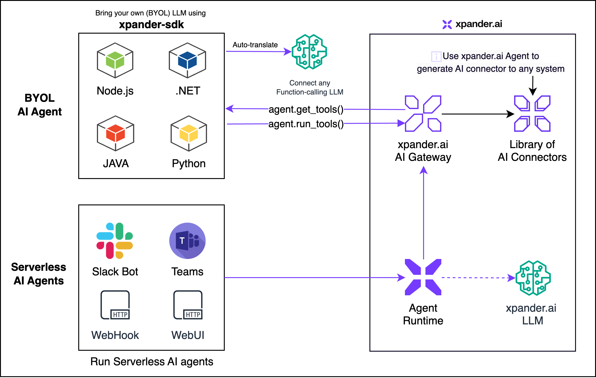

# Xpander SDK

**Xpander Open Source SDK** empowers developers to build intelligent and reliable AI Agents capable of managing complex, multi‑step tasks across diverse systems and platforms. The SDK simplifies challenges like function calling, schema definition, graph enforcement, and prompt group management.

With first‑class support for leading LLM providers such as **OpenAI**, **Amazon Bedrock**, **Google Gemini**, **Anthropic Claude**, and **NVIDIA NIM**, the **Xpander SDK** seamlessly integrates into your existing systems.



---

## 📦 Installation

Choose your preferred package manager:

### npm

```bash
npm install xpander-sdk
```

### pip

```bash
pip install xpander-sdk
```

---

## 🚀 Getting Started

### Prerequisites

1. Sign in to [app.xpander.ai](https://app.xpander.ai) and create (or pick) an **Agent**.
2. Copy the **Agent Key** and **Agent ID** from the Agent → **Settings** page.
3. Grab the API key for your preferred LLM provider (e.g. `OPENAI_API_KEY`, `GEMINI_API_KEY`, etc.).
4. Install the SDK (see above) **and** make sure you have Node.js installed – the SDK runs a tiny Node.js runtime under the hood.

---

## 🏁 Usage Patterns

Below are the canonical patterns taken from the official documentation for working with LLMs through the Xpander SDK.

### 1. Single Query (Quick Start)

```python
from xpander_sdk import XpanderClient, LLMProvider
from openai import OpenAI
from dotenv import load_dotenv
import os

load_dotenv()

xpander_client = XpanderClient(api_key=os.getenv("XPANDER_API_KEY"))
agent          = xpander_client.agents.get(agent_id=os.getenv("XPANDER_AGENT_ID"))
openai_client  = OpenAI(api_key=os.getenv("OPENAI_API_KEY"))

# A one‑off prompt handled by the agent + tools
response = openai_client.chat.completions.create(
    model="gpt-4o",
    messages=agent.messages,  # current conversation state
    tools=agent.get_tools(llm_provider=LLMProvider.OPEN_AI),
    tool_choice="auto",
    temperature=0.0,
)

# Let the SDK execute the tool calls & keep state in sync
agent.process_llm_response(response.model_dump(), llm_provider=LLMProvider.OPEN_AI)
```

> **Tip:** `agent.process_llm_response(...)` is the easiest way to both *store* the assistant message **and** immediately run any tool calls it contains – perfect for serverless single‑turn workflows. citeturn2view0

---

### 2. Real‑Time Event Listener (xpander‑utils)

```python
from xpander_utils.events import (
    XpanderEventListener,
    AgentExecutionResult,
    AgentExecution,
    ExecutionStatus,
)
from xpander_sdk import XpanderClient, LLMProvider
from openai import OpenAI
from dotenv import load_dotenv
import os

load_dotenv()

listener = XpanderEventListener(
    api_key=os.getenv("XPANDER_API_KEY"),
    organization_id=os.getenv("XPANDER_ORG_ID"),
    agent_id=os.getenv("XPANDER_AGENT_ID"),
)

# Optional helper clients (LLM + Agent)
openai_client   = OpenAI(api_key=os.getenv("OPENAI_API_KEY"))
xpander_client  = XpanderClient(api_key=os.getenv("XPANDER_API_KEY"))
agent           = xpander_client.agents.get(agent_id=os.getenv("XPANDER_AGENT_ID"))

def on_execution_request(execution_task: AgentExecution) -> AgentExecutionResult:
    """Runs each time your cloud Agent triggers an execution request."""
    # (1) Ask the LLM what to do next
    response = openai_client.chat.completions.create(
        model="gpt-4o",
        messages=agent.messages,
        tools=agent.get_tools(llm_provider=LLMProvider.OPEN_AI),
        tool_choice="auto",
        temperature=0.0,
    )

    # (2) Persist the assistant message *and* execute any tool calls
    agent.process_llm_response(response.model_dump(), llm_provider=LLMProvider.OPEN_AI)

    # (3) Return the final result back to the platform
    return AgentExecutionResult(
        result=agent.retrieve_execution_result().result,
        status=ExecutionStatus.SUCCEEDED,
    )

# Block forever, listening for events via SSE
listener.register(on_execution_request=on_execution_request)
```

> **Why `xpander-utils`?** The `XpanderEventListener` uses a lightweight Server‑Sent Events (SSE) channel to deliver execution requests to your code with sub‑second latency—perfect for Slack, Teams, and other real‑time chat surfaces. ([pypi.org](https://pypi.org/project/xpander-utils/?utm_source=chatgpt.com))

---

### 3. Multi‑Step Tasks (Long‑running autonomous workflows)

```python
# Describe a complex objective for the agent
multi_step_task = """
Find employees of xpander.ai and their roles.
Then check their LinkedIn profiles for recent updates.
"""

agent.add_task(multi_step_task)  # automatically initialises memory

while not agent.is_finished():
    response = openai_client.chat.completions.create(
        model="gpt-4o",
        messages=agent.messages,
        tools=agent.get_tools(llm_provider=LLMProvider.OPEN_AI),
        tool_choice="auto",
        temperature=0.0,
    )

    agent.process_llm_response(response.model_dump(), llm_provider=LLMProvider.OPEN_AI)

# 🚀 Grab the final result once the agent marks itself as finished
execution_result = agent.retrieve_execution_result()
print(execution_result.status)  # e.g. "SUCCEEDED"
print(execution_result.result)  # your task output
```

This loop lets the LLM break the objective into sub‑steps, call tools, update memory and eventually mark the task as **finished**. citeturn2view0

---

### 4. Complete Example – Gemini via the OpenAI‑compatible API

```python
from xpander_sdk import XpanderClient, LLMProvider
from openai import OpenAI
from dotenv import load_dotenv
from os import environ

load_dotenv()

xpander_client = XpanderClient(api_key=environ["XPANDER_API_KEY"])
gemini_client  = OpenAI(
    api_key=environ["GEMINI_API_KEY"],
    base_url="https://generativelanguage.googleapis.com/v1beta/openai/",
)

agent = xpander_client.agents.get(agent_id=environ["XPANDER_AGENT_ID"])
agent.add_task("Find employees of xpander.ai.")

while not agent.is_finished():
    response = gemini_client.chat.completions.create(
        model="gemini-2.0-flash",
        messages=agent.messages,
        tools=agent.get_tools(llm_provider=LLMProvider.GEMINI_OPEN_AI),
        tool_choice=agent.tool_choice,
        temperature=0.0,
    )

    agent.add_messages(response.model_dump())

    tool_calls = XpanderClient.extract_tool_calls(
        llm_response=response.model_dump(),
        llm_provider=LLMProvider.GEMINI_OPEN_AI,
    )

    agent.run_tools(tool_calls)

print(agent.retrieve_execution_result().result)
```

This demo showcases full multi‑step orchestration **without** writing any provider‑specific glue code. citeturn2view0

---

## 🏆 Best Practices (Provider‑agnostic)

1. **Create a task first** – `agent.add_task()` automatically initialises the agent’s memory and system messages.
2. **Always pass `llm_provider`** when calling `agent.get_tools()` so the SDK can return the correct schema for the target provider.
3. **Store the raw LLM response** with `agent.add_messages(...)` (or implicitly via `agent.process_llm_response`). The SDK will convert fields as required.
4. **Extract tool calls with the same provider flag** you used for `get_tools`: `XpanderClient.extract_tool_calls(llm_response, llm_provider=...)`.

Following these rules ensures your code works consistently across OpenAI, Claude, Gemini, Bedrock, and more. citeturn2view0

---

## 📚 Further Reading

* **Official Documentation:** <https://docs.xpander.ai/userguides/overview/introduction>
* **LLM SDK Guide:** <https://docs.xpander.ai/docs/01-get-started/03-llm-models>
* **API Reference:** <https://docs.xpander.ai/api-reference/SDK/getting-started>

---

## ⚙️ Technical Note

The library is generated with **Projen** and runs inside a tiny Node.js runtime. Ensure you have a recent **Node.js** version installed for optimal performance.

---

## 🤝 Contributing

We welcome contributions to improve the SDK. Please see our [CONTRIBUTING.md](CONTRIBUTING.md) for guidelines on how to submit improvements and bug fixes.

